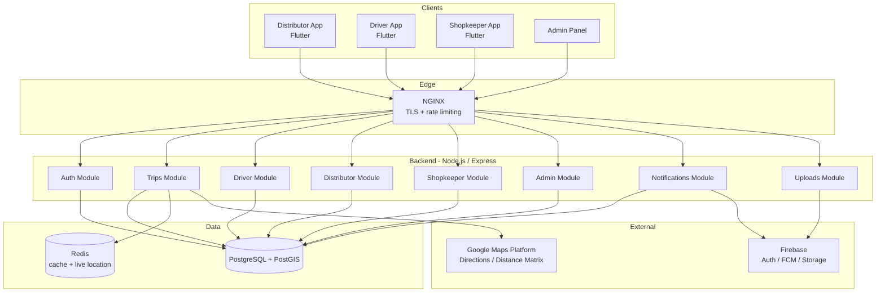

# Architecture

## System overview



## Backend layering (each module)

Every module follows the same three-layer pattern:

```
routes.js       →  HTTP contract, validation rules, Swagger annotations
controller.js   →  Request/response mapping only, no business logic
service.js      →  Business logic, transactions, DB queries
```

This keeps controllers thin and testable, and lets `service.js` files be unit-tested with a mocked `config/database` module (see `tests/unit/auth.service.test.js` for the pattern).

## Flutter layering (Clean Architecture, feature-first)

```
lib/
  core/                        Shared infrastructure - no feature imports this
    network/                   ApiClient (Dio + interceptors), ApiException
    storage/                   SecureStorage (tokens)
    router/                    GoRouter with auth-aware redirects
    theme/                     Material 3 design tokens
    providers/                 App-wide Riverpod providers

  features/<feature>/
    models/                    Plain Dart data classes
    data/                      Repository - talks to ApiClient only
    presentation/
      providers/                Riverpod providers/state notifiers
      screens/                  Widgets - read providers, never call ApiClient directly
```

Data flows one direction: `screens → providers → repository → ApiClient → backend`. A screen never imports `ApiClient` directly, which keeps every feature swappable and testable in isolation.

## Key design decisions

- **Route optimization fallback**: `utils/googleMaps.js` calls Google Directions API with waypoint optimization; if the API key is missing or the call fails, it falls back to a haversine-based nearest-neighbor ordering so trip creation never hard-fails on a third-party outage.
- **Live tracking via Redis**: GPS pings are written to `location_history` (durable) and cached in Redis under `trip:{id}:location` (fast reads for polling clients) with a 2-minute TTL.
- **Role-based access at the service layer, not just middleware**: `authorize('role')` middleware blocks the wrong role entirely, but read endpoints like live tracking additionally verify the specific trip belongs to the requesting distributor/driver/shopkeeper before returning data.
- **Delivery proof is append-only**: `delivery_proofs` rows are never updated, only inserted — an audit trail of exactly what was captured at delivery time.
