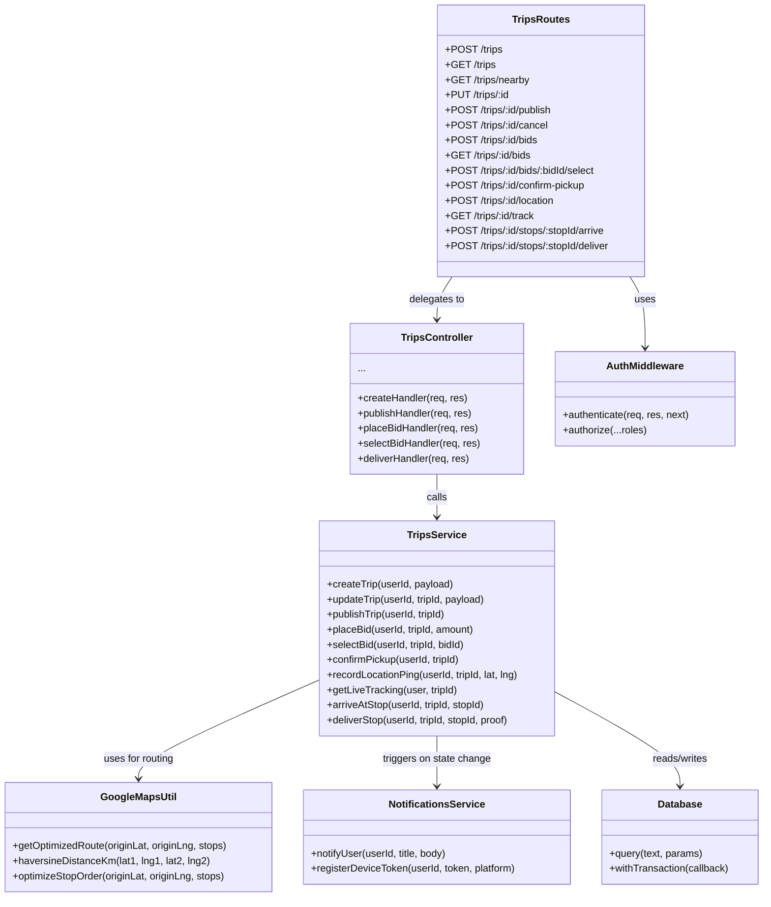
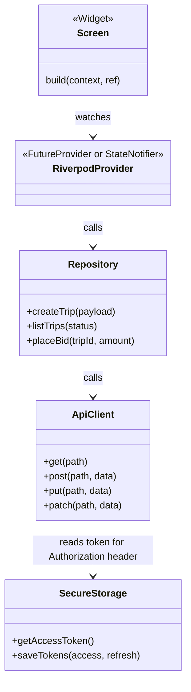

# Class / Module Diagram

Backend modules follow a consistent shape. This diagram shows the trips module (the largest) as the representative example — every other module (`auth`, `driver`, `distributor`, `shopkeeper`, `admin`, `notifications`) follows the same routes → controller → service → database pattern.

## Flutter presentation-layer pattern

