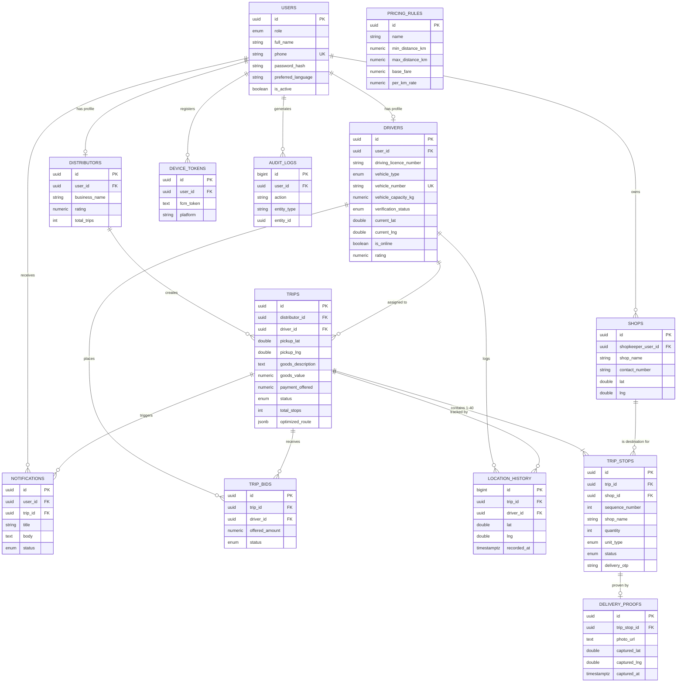

# Entity-Relationship Diagram

Rendered from `backend/src/db/migrations/001_init_schema.sql` and `002_device_tokens.sql`.

## Notes

- `trips.total_stops` is a denormalized count (1–40, enforced by a CHECK constraint) kept in sync with `trip_stops` rows for fast list-view rendering without a `COUNT()` join.
- `trip_stops.delivery_otp` is generated at trip-creation time and verified (optionally) at the delivery step — this is the "OTP" proof-of-delivery option alongside photo + GPS.
- `location_history` is append-only and unbounded; in production, add a scheduled job to archive rows older than N days to cold storage, since this table grows fastest.
- All foreign keys use `ON DELETE CASCADE` for owned child records (e.g. `trip_stops` under `trips`) and `ON DELETE SET NULL` where the parent's removal shouldn't destroy history (e.g. `trips.driver_id`).
