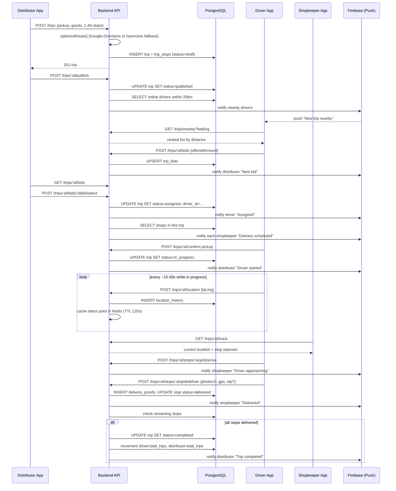
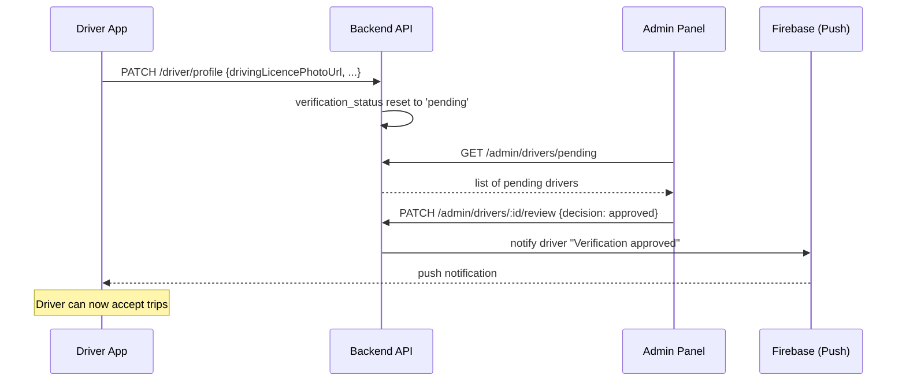

# Sequence Diagrams

## 1. Full delivery lifecycle



## 2. Authentication + token refresh

```mermaid
sequenceDiagram
    participant App as Flutter App
    participant API as Backend API
    participant DB as PostgreSQL

    App->>API: POST /auth/register {role, phone, password, ...}
    API->>DB: check phone uniqueness
    API->>DB: BEGIN; INSERT user; INSERT role profile; COMMIT
    API-->>App: {user, accessToken, refreshToken}
    App->>App: save tokens to SecureStorage

    Note over App,API: Later - access token expired
    App->>API: GET /trips (Authorization: Bearer <expired>)
    API-->>App: 401 Unauthorized
    App->>API: POST /auth/refresh {refreshToken}
    API->>API: verify refresh token
    API-->>App: {accessToken, refreshToken}
    App->>API: retry GET /trips (Authorization: Bearer <new>)
    API-->>App: 200 OK
```

## 3. Driver document verification (Admin)


